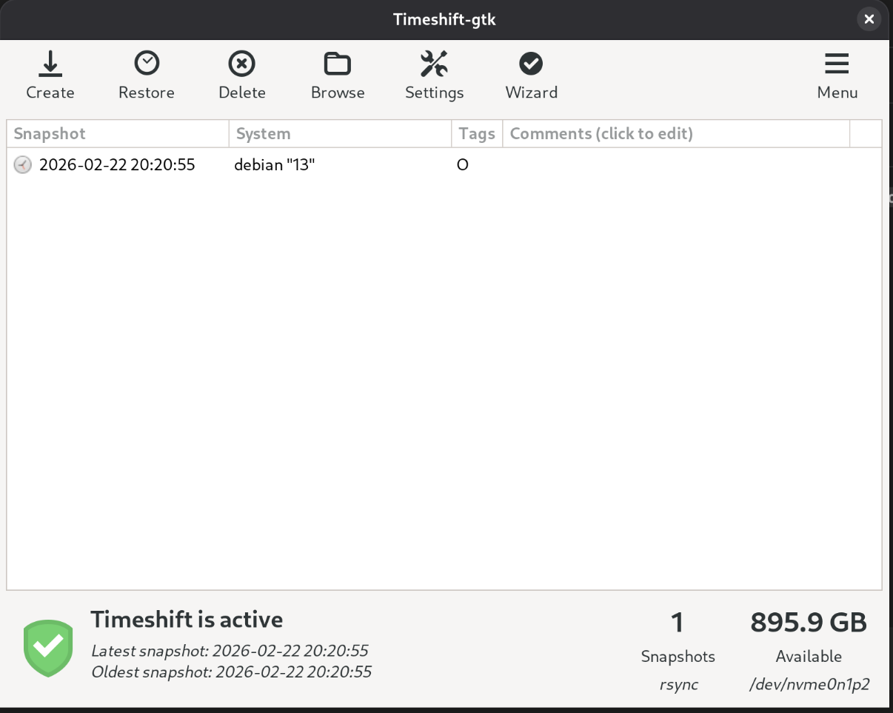

# 09 — Backups

## Estado: Completado

---

## Objetivos

- Snapshots del sistema con Timeshift para recuperación ante corrupción o actualizaciones problemáticas

---

## 1. Timeshift — snapshots del sistema

Timeshift captura el estado de `/` (sistema operativo, configuración, paquetes) para poder revertir el sistema a un punto anterior. **No hace backup de `/home`** — su propósito es exclusivamente recuperar el sistema operativo, no los datos personales.

### ¿Para qué sirve en este equipo?

| Escenario | ¿Timeshift lo cubre? |
|-----------|----------------------|
| Actualización que rompe el sistema | ✅ Revertir al snapshot anterior |
| Kernel nuevo que no inicia | ✅ Restaurar desde live USB |
| Paquete que corrompe la configuración | ✅ Rollback completo |
| Pérdida de archivos personales en `/home` | ❌ No (Timeshift excluye `/home` por defecto) |
| Fallo del disco NVMe | ❌ No (el snapshot está en el mismo disco) |

Para el uso de esta laptop (protección ante problemas del sistema Debian), **Timeshift es suficiente**.

### Instalación

```bash
sudo apt install -y timeshift
```

### Configuración aplicada (via GUI)

```bash
sudo timeshift-gtk
```

Configuración realizada via el wizard gráfico:



- **Modo:** RSYNC (compatible con ext4, no requiere Btrfs)
- **Destino:** `/dev/nvme0n1p2` — 908.1 GB disponibles
- **Estado:** activo, 0 snapshots (aún no creados)

> **Nota:** Los snapshots se guardan en la misma unidad NVMe. Esto protege contra corrupción de software pero **no** contra fallo físico del disco.

### Crear snapshots

Antes de cualquier cambio importante (actualización de kernel, drivers, cambios de configuración):

```bash
sudo timeshift --create --comments "antes de actualizar kernel" --tags B
```

Tags disponibles: `O` (manual), `B` (boot), `H` (hourly), `D` (daily), `W` (weekly), `M` (monthly).

Ver snapshots existentes:

```bash
sudo timeshift --list
```

---

## 2. Recuperación ante problemas

### Caso 1: El sistema inicia pero algo está roto

Desde el sistema en funcionamiento:

```bash
sudo timeshift --list                        # identificar el snapshot a restaurar
sudo timeshift --restore --snapshot '2025-XX-XX_XX-XX-XX'
```

O via GUI:

```bash
sudo timeshift-gtk    # botón Restore
```

Timeshift reinstala GRUB automáticamente tras la restauración.

### Caso 2: El sistema no inicia (más común tras actualización de kernel)

1. Arrancar desde un **Live USB de Debian**
2. Abrir terminal e instalar Timeshift si no está en el live:
   ```bash
   sudo apt install -y timeshift
   ```
3. Montar la partición del sistema (identificar con `lsblk`):
   ```bash
   sudo timeshift --restore --snapshot-device /dev/nvme0n1p2
   ```
   O con la GUI del live: `sudo timeshift-gtk`

4. Timeshift detecta los snapshots existentes, seleccionar el más reciente funcional y restaurar.

### Caso 3: Probar si GRUB tiene entrada de rescate

Antes de recurrir al live USB, al encender el equipo probar:

- Mantener `Shift` durante el arranque para mostrar el menú de GRUB
- Seleccionar una versión anterior del kernel si está disponible (`Advanced options for Debian`)

---

## Notas

<!-- Agregar notas y resultados al ejecutar -->
